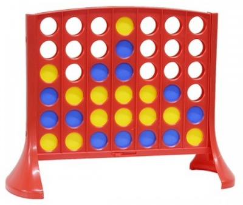
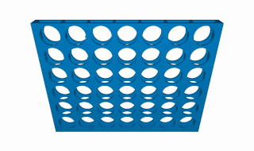

# 🎮 LIG4 - Connect Four 🎮

Este jogo é constituído por uma estrutura de 7 colunas e 6 linhas com perfurações visíveis 
(de forma que se possa ver onde estão as fichas colocadas) e os jogadores se alternam 
colocando as fichas pela parte de cima. Como é apresentado nas imagens abaixo.

<h1 align="center">
  
  
  
  <h4 align="center">
    <a href="https://en.wikipedia.org/wiki/Connect_Four">
        Wikipedia - Connect Four
    </a>
  </h4>
</h1>

## 📌 Objetivo

O objetivo do jogo é ser o primeiro jogador a 
conseguir formar uma sequência de 4 fichas da mesma cor, seja na horizontal, na vertical 
ou mesmo na diagonal.

## 🎯 Como jogar?

No início do jogo cada jogador escolhe uma cor (amarela ou azul) e recebe as 21 fichas 
da cor correspondente. O jogador com as fichas amarelas começa a partida colocando a 
primeira ficha e os jogadores se revezam colocando 1 ficha de cada vez. Para vencer, 
os jogadores devem colocar as fichas estratégicamente na base, de forma a formar uma 
sequência com as 4 fichas da sua cor, ao mesmo tempo em que devem prestar atenção para 
bloquear as tentativas do oponente fazer o mesmo. O jogador faz ponto quando uma sequência(s)
de 4 peças da mesma cor é formada como foi apresentado no objetivo, o jogador que atingir o maior número de pontos no final da partida
é o vencedor. O final da partida é dada após preencher todos os espaços do brinquedo.

**Lig 4** é um jogo de regras simples, mas ao mesmo tempo bastante estratégico e divertido, 
em que é importante prestar atenção nas jogadas do adversário para conseguir alcançar o 
maior número de pontos e consecutivamente a vitória.

# 🧑‍💻 Código 🎮

## 🧩 Propósito do código

O propósito do código é simular o jogo descrito acima através de um terminal.
Segue imagem de exemplo.

## � Como executar

1. Certifique-se de ter Python 3 instalado.
2. Clone ou baixe o repositório.
3. Navegue até a pasta do projeto.
4. Execute o comando: `python main.py`
5. Escolha o modo de jogo (1 ou 2) e siga as instruções no terminal.

## �📚 Referência

[Wikipedia - Connect Four](https://en.wikipedia.org/wiki/Connect_Four)

## 📝 Autor do código

[@WellersonPrenholato](https://github.com/WellersonPrenholato)
